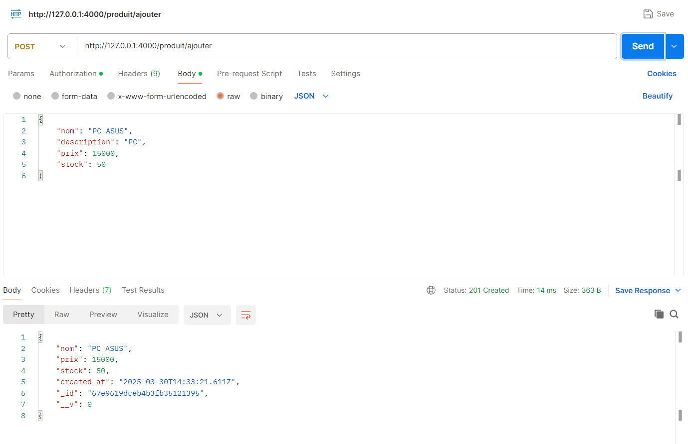
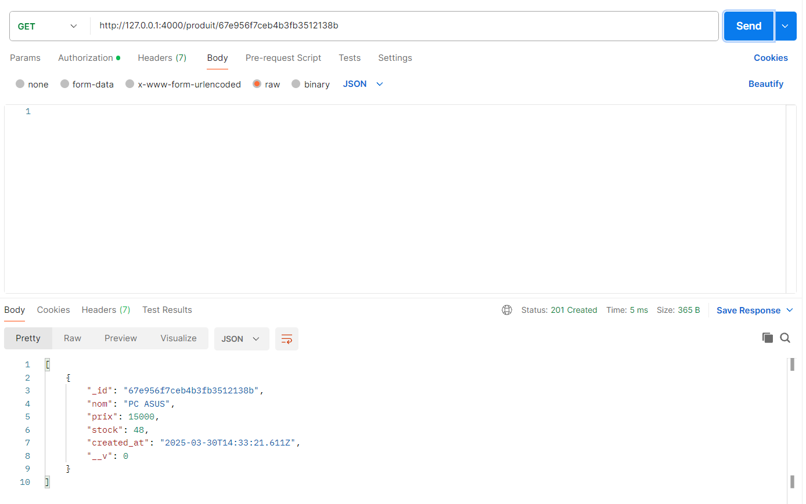
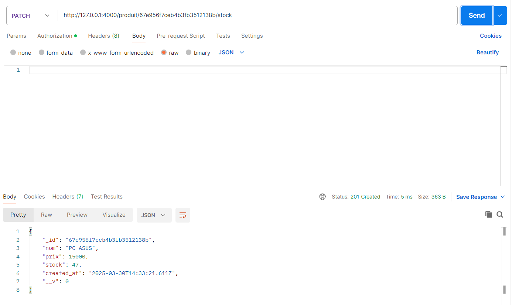
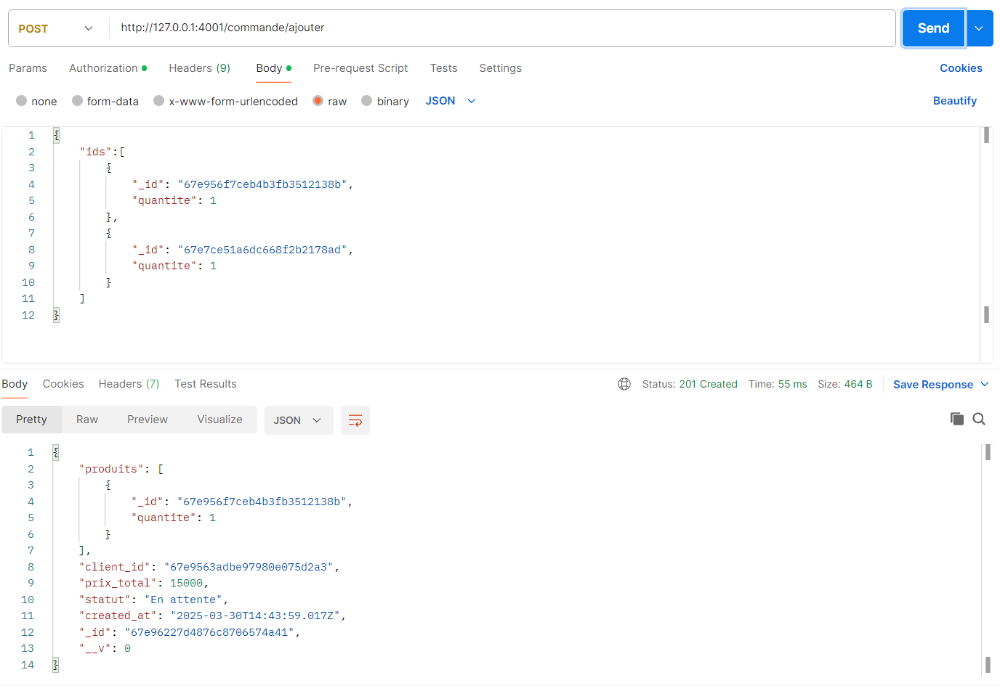
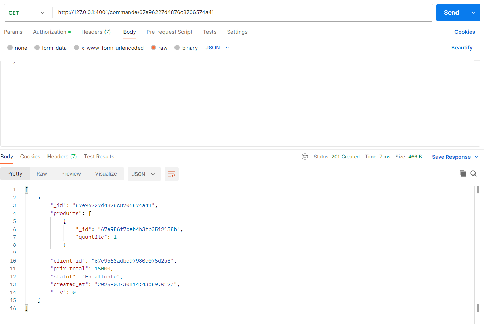
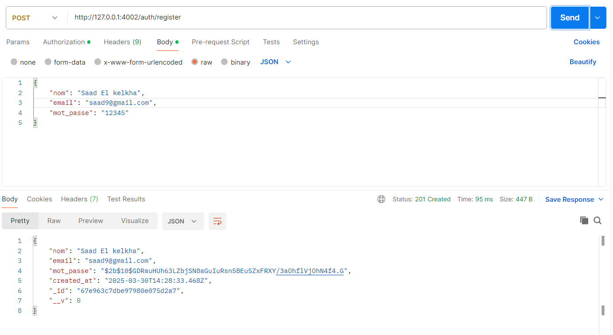
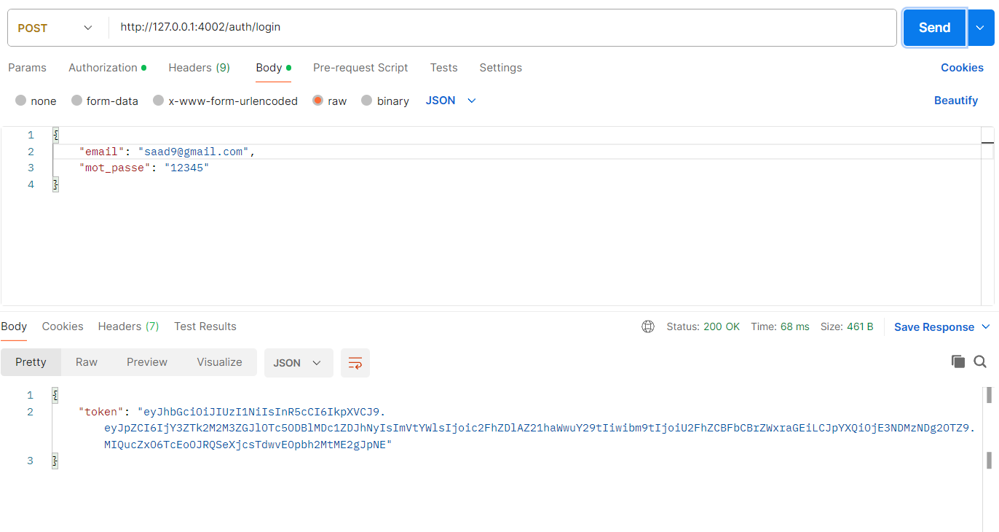

**FastDelivery Microservices** 🚀  

A microservices-based architecture for **FastDelivery**, a startup managing deliveries for multiple e-commerce platforms. The system is built using **MongoDB**, **Node.js**, and **Express**, with four independent microservices:  

### 📌 **Microservices Overview**  
- **🛍️ Product Service**: Manages product catalog.  
- **📦 Order Service**: Handles customer orders.  
- **🚚 Delivery Service**: Manages order shipments.  
- **🔐 Authentication Service**: Manages users (customers & couriers).  

### ⚙️ **Core Features**  
- **MongoDB** models for each microservice  
- **REST API** endpoints for CRUD operations  
- **JWT Authentication** for secure access  
- **Stock & order status updates**  
- **Carrier assignment for deliveries**  

### 📂 **API Endpoints**  

#### **🛍️ Product Service**  
- `POST /produit/ajouter ` → Add a new product
  
- `GET /produit/:id` → Get product details
  
- `PATCH /produit/:id/stock` → Update stock
  

#### **📦 Order Service**  
- `POST /commande/ajouter` → Place a new order
  
- `GET /commande/:id` → Retrieve order details
  
- `PATCH /commande/:id/statut` → Update order status
  

#### **🚚 Delivery Service**  
- `POST /livraison/ajouter` → Assign a carrier & create delivery
  
- `PUT /livraison/:id` → Update delivery status
  

#### **🔐 Authentication Service**  
- `POST /auth/register` → Register a new user
  
- `POST /auth/login` → Authenticate & get JWT
  
- `GET /auth/profil` → Get user details (JWT required)
  

### 🛠 **Tech Stack**  
- **Backend**: Node.js, Express  
- **Database**: MongoDB  
- **Authentication**: JWT   

🚀 **Contributions & Feedback Welcome!**
